# 📚 GameNews - Documentación para Estudiantes

## 📋 Índice
1. [Visión General del Proyecto](#-visión-general-del-proyecto)
2. [Funcionalidades y Casos de Uso](#-funcionalidades-y-casos-de-uso)
3. [Flujos de Usuario](#-flujos-de-usuario)
4. [Base de Datos y Relaciones](#️-base-de-datos-y-relaciones)
5. [Implementación Técnica](#️-implementación-técnica)
6. [Interfaces de Usuario](#-interfaces-de-usuario)
7. [Consejos para Estudiantes](#-consejos-para-estudiantes)
8. [Referencias y Recursos](#-referencias-y-recursos)

## 🎮 Visión General del Proyecto

GameNews es un portal web de noticias sobre videojuegos desarrollado con Symfony 6.4. El proyecto simula un CMS (Sistema de Gestión de Contenidos) real, donde diferentes tipos de usuarios pueden interactuar con el contenido de distintas formas.

### 🎯 Objetivo Principal
Crear una plataforma donde:
- Los editores pueden publicar y gestionar noticias
- Los usuarios pueden leer, comentar y valorar el contenido
- Los administradores pueden moderar y gestionar todo el sistema

## 🔄 Funcionalidades y Casos de Uso

### Mapa de Casos de Uso y sus Relaciones

```mermaid
graph TD
    CU00[CU00: Página Principal] --> CU05[CU05: Explorar noticias]
    CU00 --> CU06[CU06: Buscar contenido]
    CU00 --> CU20[CU20: Ver noticia]
    
    %% Flujo de Usuario No Registrado
    U([Usuario No Registrado]) --> CU01[CU01: Registrarse]
    U --> CU02[CU02: Autenticarse]
    
    %% Flujo de Usuario Registrado
    CU02 --> CU04[CU04: Editar perfil]
    CU02 --> CU07[CU07: Comentar contenido]
    CU02 --> CU09[CU09: Votar comentario]
    CU02 --> CU10[CU10: Votar noticia]
    CU02 --> CU11[CU11: Suscribirse al boletín]
    
    %% Flujo de Editor/Admin
    CU02 --> CU12[CU12: Gestión de noticias]
    CU02 --> CU13[CU13: Editar categorías]
    CU02 --> CU14[CU14: Editar etiquetas]
    
    %% Relaciones de Contenido
    CU20 --> CU07
    CU20 --> CU09
    CU20 --> CU10
    
    %% Relaciones de Gestión
    CU12 --> CU13
    CU12 --> CU14
```



### Descripción de Relaciones entre Casos de Uso

1. **Flujo Principal de Navegación**
   - `CU00` (Página Principal) es el punto de entrada que permite acceder a:
     - `CU05` (Explorar noticias)
     - `CU06` (Buscar contenido)
     - `CU20` (Ver noticia)

2. **Flujo de Autenticación**
   - `CU01` (Registrarse) permite crear una cuenta nueva
   - `CU02` (Autenticarse) es prerequisito para:
     - `CU04` (Editar perfil)
     - `CU07` (Comentar contenido)
     - `CU09` (Votar comentario)
     - `CU10` (Votar noticia)
     - `CU11` (Suscribirse al boletín)

3. **Flujo de Interacción con Noticias**
   - `CU20` (Ver noticia) habilita:
     - `CU07` (Comentar contenido)
     - `CU09` (Votar comentario)
     - `CU10` (Votar noticia)

4. **Flujo de Gestión de Contenido**
   - `CU12` (Gestión de noticias) se relaciona con:
     - `CU13` (Editar categorías)
     - `CU14` (Editar etiquetas)
   - Requiere permisos de ROLE_EDITOR o ROLE_ADMIN

### Dependencias y Prerrequisitos

| Caso de Uso | Prerrequisitos | Rol Mínimo |
|-------------|----------------|-------------|
| CU00 | Ninguno | Visitante |
| CU01 | Ninguno | Visitante |
| CU02 | Cuenta existente | Visitante |
| CU04 | CU02 | USER |
| CU05 | Ninguno | Visitante |
| CU06 | Ninguno | Visitante |
| CU07 | CU02, CU20 | USER |
| CU09 | CU02, CU20 | USER |
| CU10 | CU02, CU20 | USER |
| CU11 | CU02 | USER |
| CU12 | CU02 | EDITOR |
| CU13 | CU02 | ADMIN |
| CU14 | CU02 | EDITOR |
| CU20 | Ninguno | Visitante |

### Sistema de Usuarios (Registro y Autenticación)
1. **Registro (CU01)**
   - Usuario completa formulario con email y contraseña
   - Sistema valida datos y crea cuenta
   - Se envía email de bienvenida
   - Se crea perfil básico

2. **Login (CU02)**
   - Usuario introduce credenciales
   - Sistema verifica y permite acceso
   - Se registra fecha de último acceso
   - Protección contra intentos fallidos

3. **Gestión de Perfil (CU04)**
   - Modificar datos personales
   - Cambiar foto de perfil
   - Gestionar preferencias
   - Ver historial de actividad

### Sistema de Noticias
1. **Exploración de Noticias (CU05)**
   - Listado paginado
   - Filtros por categoría
   - Ordenamiento por fecha/popularidad
   - Vista previa con imagen destacada

2. **Gestión de Noticias (CU12)**
   - Crear nueva noticia
   - Editar existente
   - Asignar categorías y etiquetas
   - Gestionar estado (borrador/publicado)

3. **Visualización de Noticia (CU20)**
   - Contenido completo
   - Metadata (autor, fecha, categorías)
   - Sistema de valoraciones
   - Comentarios asociados

### Sistema de Interacción
1. **Comentarios (CU07)**
   - Añadir comentario
   - Responder a otros
   - Votar comentarios
   - Reportar contenido inadecuado

2. **Valoraciones (CU10)**
   - Calificar noticias (1-5 estrellas)
   - Ver promedio de valoraciones
   - Actualización en tiempo real
   - Un voto por usuario

### Sistema de Búsqueda (CU06)
- Búsqueda por texto
- Filtros avanzados
- Sugerencias de búsqueda
- Resultados relevantes

## 🔄 Flujos de Usuario

Extension para ver Graficos Mermaid: Markdown Preview Mermaid Support
Luego abrir: https://mermaid.live y copiar el codigo en el browser.

### 1. Flujo de Lectura

```mermaid
graph LR
    A[Usuario] --> B[Página Principal]
    B --> C[Lista de Noticias]
    C --> D[Noticia Individual]
    D --> E[Comentar]
    D --> F[Valorar]
    D --> G[Compartir]
```


### 2. Flujo de Publicación

```mermaid
graph LR
    A[Editor] --> B[Panel Admin]
    B --> C[Nueva Noticia]
    C --> D[Borrador]
    D --> E[Revisión]
    E --> F[Publicación]
```


### 3. Flujo de Moderación

```mermaid
graph LR
    A[Admin] --> B[Panel Control]
    B --> C[Reportes]
    C --> D[Revisar Contenido]
    D --> E[Tomar Acción]
```


## 🗃️ Base de Datos y Relaciones

### Entidades Principales y Relaciones

1. **User (Usuario)**
   - Relacionado con:
     - News (como autor)
     - Comments (como autor)
     - NewsRating (valoraciones dadas)
     - CommentVote (votos en comentarios)
     - Report (denuncias realizadas)

2. **News (Noticia)**
   - Relacionado con:
     - User (autor)
     - Category (categorías)
     - Tag (etiquetas)
     - Comment (comentarios)
     - NewsRating (valoraciones)

3. **Comment (Comentario)**
   - Relacionado con:
     - User (autor)
     - News (noticia comentada)
     - CommentVote (votos)
     - Report (denuncias)

### Diagrama de Relaciones Simplificado
```
User 1 ----* News (Autor)
News 1 ----* Comment
User 1 ----* Comment (Autor)
News * ----* Category
News * ----* Tag
User 1 ----* NewsRating
User 1 ----* CommentVote
```

## 🛠️ Implementación Técnica

### Estructura MVC
1. **Modelos (Entities)**
   - Ubicación: `src/Entity/`
   - Representan tablas de la base de datos
   - Usan anotaciones Doctrine
   - Implementan getters/setters

2. **Vistas (Templates)**
   - Ubicación: `templates/`
   - Usan Twig como motor de plantillas
   - Heredan de base.html.twig
   - Responsive con Bootstrap 5

3. **Controladores**
   - Ubicación: `src/Controller/`
   - Manejan la lógica de negocio
   - Procesan formularios
   - Retornan respuestas

### Ejemplos de Código Clave y su Relación con Casos de Uso

#### 1. Registro y Autenticación (CU01, CU02)
```php
// RegistrationController.php
#[Route('/register', name: 'app_register')]
public function register(Request $request): Response
{
    // CU01: Registro de Usuario
    $user = new User();
    $form = $this->createForm(RegistrationFormType::class, $user);
    $form->handleRequest($request);

    if ($form->isSubmitted() && $form->isValid()) {
        // Hashear la contraseña antes de guardar
        $user->setPassword(
            $this->passwordHasher->hashPassword($user, $form->get('plainPassword')->getData())
        );
        
        // Asignar rol básico y fecha de creación
        $user->setRoles(['ROLE_USER']);
        $user->setCreatedAt(new \DateTimeImmutable());
        
        // Persistir usuario
        $this->entityManager->persist($user);
        $this->entityManager->flush();
        
        // Redireccionar a login
        return $this->redirectToRoute('app_login');
    }
}

// SecurityController.php
// CU02: Autenticación
#[Route('/login', name: 'app_login')]
public function login(AuthenticationUtils $authenticationUtils): Response
{
    // Obtener error de autenticación si existe
    $error = $authenticationUtils->getLastAuthenticationError();
    $lastUsername = $authenticationUtils->getLastUsername();

    return $this->render('security/login.html.twig', [
        'last_username' => $lastUsername,
        'error' => $error,
    ]);
}
```

#### 2. Gestión de Perfil (CU04)
```php
// ProfileController.php
#[Route('/profile/edit', name: 'app_profile_edit')]
public function edit(Request $request): Response
{
    // CU04: Editar Perfil
    $user = $this->getUser();
    $form = $this->createForm(ProfileFormType::class, $user);
    
    if ($form->isSubmitted() && $form->isValid()) {
        // Procesar imagen de perfil si se subió una nueva
        $profileImage = $form->get('profileImage')->getData();
        if ($profileImage) {
            $newFilename = $this->uploadProfileImage($profileImage);
            $user->setProfileImage($newFilename);
        }
        
        $this->entityManager->flush();
        $this->addFlash('success', 'Perfil actualizado correctamente');
    }
}
```

#### 3. Sistema de Noticias (CU05, CU12, CU20)
```php
// NewsController.php
// CU05: Explorar noticias
#[Route('/news', name: 'app_news_index')]
public function index(Request $request, PaginatorInterface $paginator): Response
{
    // Obtener parámetros de filtrado
    $filters = $request->query->all();
    
    // Construir query base
    $query = $this->newsRepository->createQueryBuilder('n')
        ->where('n.status = :status')
        ->setParameter('status', 'published')
        ->orderBy('n.publishedAt', 'DESC');
    
    // Aplicar filtros adicionales
    if (!empty($filters['category'])) {
        $query->innerJoin('n.categories', 'c')
              ->andWhere('c.id = :categoryId')
              ->setParameter('categoryId', $filters['category']);
    }
    
    // Paginar resultados
    $news = $paginator->paginate(
        $query,
        $request->query->getInt('page', 1),
        10
    );
    
    return $this->render('news/index.html.twig', ['news' => $news]);
}

// CU12: Gestión de noticias
#[Route('/news/new', name: 'app_news_new')]
#[IsGranted('ROLE_EDITOR')]
public function new(Request $request): Response
{
    $news = new News();
    $form = $this->createForm(NewsFormType::class, $news);
    
    if ($form->isSubmitted() && $form->isValid()) {
        // Asignar autor y fechas
        $news->setAuthor($this->getUser());
        $news->setCreatedAt(new \DateTime());
        
        if ($news->getStatus() === 'published') {
            $news->setPublishedAt(new \DateTime());
        }
        
        // Procesar imagen destacada
        $featuredImage = $form->get('featuredImage')->getData();
        if ($featuredImage) {
            $filename = $this->uploadNewsImage($featuredImage);
            $news->setFeaturedImage($filename);
        }
        
        $this->entityManager->persist($news);
        $this->entityManager->flush();
    }
}

// CU20: Ver noticia
#[Route('/news/{slug}', name: 'app_news_show')]
public function show(News $news): Response
{
    // Incrementar contador de vistas
    $news->setViewCount($news->getViewCount() + 1);
    $this->entityManager->flush();
    
    return $this->render('news/show.html.twig', [
        'news' => $news,
        'userRating' => $this->getUserRating($news),
        'comments' => $this->getApprovedComments($news)
    ]);
}
```

#### 4. Sistema de Interacción (CU07, CU09, CU10)
```php
// CommentController.php
// CU07: Comentar contenido
#[Route('/news/{id}/comment', name: 'app_comment_add')]
#[IsGranted('ROLE_USER')]
public function addComment(News $news, Request $request): Response
{
    $comment = new Comment();
    $form = $this->createForm(CommentFormType::class, $comment);
    
    if ($form->isSubmitted() && $form->isValid()) {
        $comment->setAuthor($this->getUser())
                ->setNews($news)
                ->setCreatedAt(new \DateTime())
                ->setIsApproved(true);
        
        $this->entityManager->persist($comment);
        $this->entityManager->flush();
    }
}

// CU09: Votar comentario
#[Route('/comment/{id}/vote', name: 'app_comment_vote', methods: ['POST'])]
#[IsGranted('ROLE_USER')]
public function vote(Comment $comment, Request $request): JsonResponse
{
    // Verificar si el usuario ya votó
    $existingVote = $this->commentVoteRepository->findOneBy([
        'user' => $this->getUser(),
        'comment' => $comment
    ]);
    
    if ($existingVote) {
        return new JsonResponse(['error' => 'Ya has votado este comentario'], 400);
    }
    
    // Crear nuevo voto
    $vote = new CommentVote();
    $vote->setUser($this->getUser())
         ->setComment($comment)
         ->setType($request->request->get('type'));
    
    $this->entityManager->persist($vote);
    $this->entityManager->flush();
    
    return new JsonResponse([
        'likes' => $comment->getLikesCount(),
        'dislikes' => $comment->getDislikesCount()
    ]);
}

// NewsController.php
// CU10: Votar noticia
#[Route('/news/{id}/rate', name: 'app_news_rate', methods: ['POST'])]
#[IsGranted('ROLE_USER')]
public function rate(News $news, Request $request): JsonResponse
{
    $rating = $request->request->getInt('rating', 0);
    if ($rating < 1 || $rating > 5) {
        return new JsonResponse(['error' => 'Valoración inválida'], 400);
    }
    
    // Verificar si el usuario ya valoró
    $existingRating = $this->newsRatingRepository->findOneBy([
        'user' => $this->getUser(),
        'news' => $news
    ]);
    
    if ($existingRating) {
        $existingRating->setRating($rating);
    } else {
        $newsRating = new NewsRating();
        $newsRating->setUser($this->getUser())
                  ->setNews($news)
                  ->setRating($rating);
        $this->entityManager->persist($newsRating);
    }
    
    // Actualizar promedio en la noticia
    $news->updateAverageRating();
    $this->entityManager->flush();
    
    return new JsonResponse([
        'average' => $news->getAverageRating(),
        'count' => $news->getRatingCount()
    ]);
}
```

### Seguridad y Roles

1. **Jerarquía de Roles**
   ```
   ROLE_USER (básico)
      ↓
   ROLE_EDITOR (publicación)
      ↓
   ROLE_ADMIN (total)
   ```

2. **Protección de Rutas**
   ```php
   #[IsGranted('ROLE_EDITOR')]
   class NewsController
   ```

### Formularios y Validación

1. **Validación de Datos**
   - Constraints de Symfony
   - Validación del lado del cliente
   - Mensajes de error personalizados

2. **Procesamiento de Imágenes**
   - Subida segura
   - Generación de miniaturas
   - Validación de tipos

## 📱 Interfaces de Usuario

### Páginas Principales
1. **Home**
   - Noticias destacadas
   - Últimas publicaciones
   - Estadísticas rápidas

2. **Listado de Noticias**
   - Filtros y búsqueda
   - Paginación
   - Ordenamiento

3. **Panel de Administración**
   - Gestión de contenido
   - Moderación
   - Estadísticas

## 🎯 Consejos para Estudiantes

1. **Por Dónde Empezar**
   - Estudiar el modelo de datos
   - Entender los flujos de usuario
   - Revisar la seguridad primero

2. **Puntos Importantes**
   - Sistema de autenticación
   - Gestión de permisos
   - Manejo de formularios
   - Relaciones de entidades

3. **Áreas de Extensión**
   - API REST
   - Sistema de notificaciones
   - Chat en tiempo real
   - App móvil

## 📚 Referencias y Recursos

### Documentación Oficial
- [Symfony Documentation](https://symfony.com/doc/current/index.html)
- [Doctrine ORM](https://www.doctrine-project.org/projects/orm.html)
- [Twig](https://twig.symfony.com/doc/)
