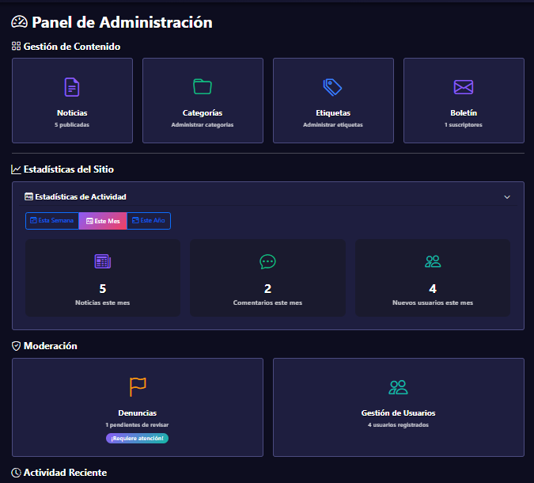

# 🎮 GameNews - Portal de Noticias sobre Videojuegos


Portal web completo para publicación y gestión de noticias sobre videojuegos, desarrollado con Symfony 6.4 como proyecto académico.

## Descripción

GameNews es una plataforma web moderna que permite a los usuarios leer, comentar y valorar noticias sobre videojuegos. Cuenta con un sistema completo de administración, roles de usuario, y funcionalidades avanzadas de búsqueda y filtrado.

## Características Principales

### Para Usuarios (Lectores)
- 📰 Explorar noticias publicadas con sistema de paginación
- 🔍 Búsqueda avanzada por texto, categorías, etiquetas y fechas
- ⭐ Sistema de valoración de noticias (1-5 estrellas)
- 💬 Comentar en noticias (publicación inmediata)
- 👍👎 Votar comentarios (me gusta / no me gusta)
- 🚩 Denunciar comentarios inapropiados
- 📧 Suscripción al boletín de noticias
- 👤 Gestión de perfil personal (foto y nombre de usuario)

### Para Editores de Contenido
- ✍️ Crear y editar noticias con editor enriquecido
- 📁 Gestionar categorías de noticias
- 🏷️ Gestionar etiquetas (con sistema de sinónimos)
- 🖼️ Subir imágenes o asignación automática según título
- 📊 Ver actividad reciente
- 📬 Gestionar suscriptores del boletín
- ✉️ Enviar boletines personalizados

### Para Administradores
- 📈 Dashboard con estadísticas del sitio
- 📊 Filtros de estadísticas (semana/mes/año)
- 👥 Gestión completa de usuarios
- 🛡️ Sistema de moderación de denuncias
- 🔐 Asignación y gestión de roles
- 📉 Métricas de actividad y engagement

## Tecnologías Utilizadas

### Backend
- **Framework:** Symfony 6.4
- **PHP:** 8.2+
- **Base de Datos:** MySQL 8.0
- **ORM:** Doctrine
- **Seguridad:** Symfony Security Bundle
- **Paginación:** KnpPaginatorBundle

### Frontend
- **CSS Framework:** Bootstrap 5.3
- **Iconos:** Bootstrap Icons
- **Plantillas:** Twig
- **JavaScript:** Vanilla JS (votaciones AJAX)

## Instalación

### Requisitos Previos
- PHP 8.2 o superior
- Composer
- MySQL 8.0 o superior
- Laragon (recomendado) o servidor web compatible

### Pasos de Instalación

1. **Clonar el repositorio**
```bash
git clone https://github.com/RamassafraGH/PP1-GameNews.git
cd PP1-GameNews
```

2. **Instalar dependencias**
```bash
composer install
npm install
npm run build
```

3. **Configurar la base de datos**

Editar el archivo `.env`:
```env
DATABASE_URL="mysql://root:@127.0.0.1:3306/gamenews?serverVersion=8.0&charset=utf8mb4"
```

4. **Crear la base de datos y ejecutar migraciones**
```bash
php bin/console doctrine:database:create
php bin/console doctrine:migrations:migrate
```

5. **Cargar datos de prueba (opcional)**
```bash
php bin/console doctrine:fixtures:load
```

6. **Crear directorios de uploads**
```bash
mkdir -p public/uploads/profiles
mkdir -p public/uploads/news
mkdir -p public/uploads/news/predefined
```

7. **Iniciar el servidor y acceder**

- Copiar el archivo conf dentro de docs/serverTest y colocarlo en laragon\etc\apache2\sites-enabled
- URL Server: http://pp1-gamenews.test/

```bash
# Opcion PHP nativo
php -S localhost:8000 -t public
```
- URL PHP: http://localhost:8000

## Usuarios de Prueba

Si cargaste los fixtures, puedes usar:

|          Email        | Contraseña | Rol           |
|-----------------------|------------|---------------|
|  admin@gamenews.com   | Admin123   | Administrador |
|  editor@gamenews.com  | Editor123  | Editor        |
|  usuario@gamenews.com | Usuario123 | Usuario       |

## Estructura del Proyecto
```
PP1-GameNews/
├── config/              # Configuración de Symfony
├── public/              # Archivos públicos
│   └── uploads/         # Imágenes subidas
├── src/
│   ├── Command/         # Comandos de consola
│   ├── Controller/      # Controladores
│   │   └── Admin/       # Controladores del panel admin
│   ├── Entity/          # Entidades Doctrine
│   ├── Form/            # Formularios Symfony
│   ├── Repository/      # Repositorios Doctrine
│   └── Service/         # Servicios personalizados
├── templates/           # Plantillas Twig
│   ├── admin/           # Vistas del panel admin
│   ├── home/            # Página principal
│   ├── news/            # Noticias
│   ├── profile/         # Perfil de usuario
│   └── security/        # Login/Registro
└── var/                 # Cache y logs
```

## Casos de Uso Implementados

- **CU00:** Página Principal
- **CU01:** Registrarse
- **CU02:** Autenticarse
- **CU04:** Editar perfil
- **CU05:** Explorar noticias
- **CU06:** Buscar contenido
- **CU07:** Comentar contenido
- **CU09:** Votar comentario
- **CU10:** Votar noticia
- **CU11:** Suscribirse al boletín
- **CU12:** Gestión de noticias
- **CU13:** Editar categorías
- **CU14:** Editar etiquetas
- **CU20:** Ver noticia

# Sistema de Roles

### Jerarquía de Roles
```
ROLE_USER (Usuario básico)
    ↓
ROLE_EDITOR (Editor de contenido) 
    ↓
ROLE_ADMIN (Administrador)
```

### Permisos por Rol

**ROLE_USER:**
- Ver noticias
- Comentar
- Votar noticias y comentarios
- Denunciar comentarios
- Gestionar perfil personal

**ROLE_EDITOR (incluye permisos de USER):**
- Crear/editar/eliminar noticias
- Gestionar categorías y etiquetas
- Ver suscriptores del boletín
- Enviar boletines

**ROLE_ADMIN (incluye permisos de EDITOR):**
- Ver estadísticas del sitio
- Moderar denuncias
- Gestionar usuarios
- Asignar roles
- Acceso completo al sistema

## Comandos Útiles

### Gestión de Usuarios
```bash
# Crear administrador
php bin/console app:create-admin

# Asignar rol a usuario
php bin/console app:assign-role usuario@email.com EDITOR
```

### Base de Datos
```bash
# Crear migración
php bin/console make:migration

# Ejecutar migraciones
php bin/console doctrine:migrations:migrate

# Cargar fixtures
php bin/console doctrine:fixtures:load
```

### Cache
```bash
# Limpiar cache
php bin/console cache:clear

# Limpiar cache en producción
php bin/console cache:clear --env=prod
```

## Capturas de Pantalla

### Página Principal


### Sistema de Búsqueda


### Panel de Administración


## Solución de Problemas

### Error: "No route found"
```bash
php bin/console cache:clear
```

### Error de permisos en uploads
```bash
chmod -R 777 public/uploads
```

### Error de base de datos
Verificar que MySQL esté corriendo y las credenciales sean correctas en `.env`

## Equipo de Desarrollo

- **Taiel Giuliano**
- **Agustin Ifran Sanchez**
- **Ramiro Massafra**
- **Benjamin Zurbriggen**

## Licencia

Este proyecto es un trabajo académico desarrollado para fines educativos.

## Enlaces

- **Repositorio:** https://github.com/RamassafraGH/PP1-GameNews.git
- **Documentación Symfony:** https://symfony.com/doc/current/index.html

---

**© 2025 GameNews** - Portal de Noticias sobre Videojuegos